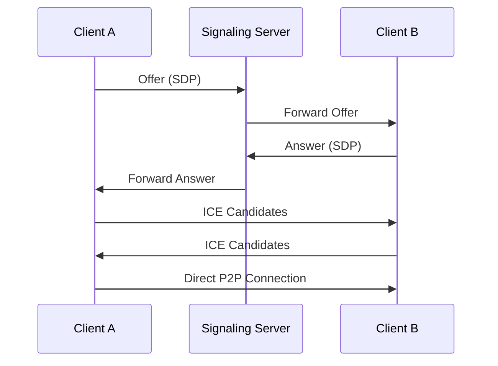
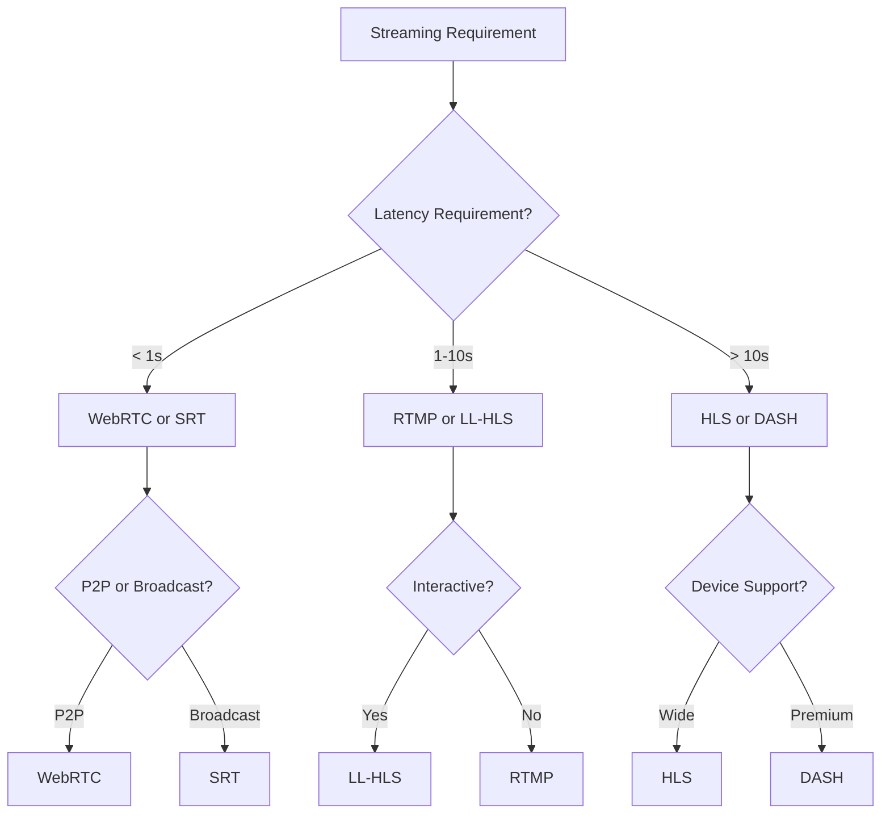

# Tìm hiểu các Protocol Streaming - So sánh và Lựa chọn phù hợp

## Giới thiệu

Streaming protocols là các tiêu chuẩn kỹ thuật quy định cách thức truyền tải video và audio qua mạng internet. Mỗi protocol có những đặc điểm, ưu nhược điểm riêng, phù hợp với các use case khác nhau. Bài viết này sẽ phân tích chi tiết các protocol streaming phổ biến và hướng dẫn lựa chọn protocol phù hợp.

## Phân loại Streaming Protocols

### Theo cách thức truyền tải:
- **Push protocols**: Server đẩy dữ liệu đến client (RTMP, WebRTC)
- **Pull protocols**: Client kéo dữ liệu từ server (HTTP-based)

### Theo độ trễ:
- **Low-latency**: < 1 giây (WebRTC, SRT)
- **Mid-latency**: 3-30 giây (RTMP, HLS Low-Latency)
- **High-latency**: 30+ giây (Traditional HLS, DASH)

### Theo phương thức:
- **Adaptive streaming**: Tự động điều chỉnh chất lượng (HLS, DASH)
- **Fixed streaming**: Chất lượng cố định (RTMP, SRT)

## RTMP (Real-Time Messaging Protocol)

### Đặc điểm
- **Phát triển**: Adobe Systems (2005)
- **Port**: 1935 (TCP)
- **Latency**: 3-5 giây
- **Transport**: TCP
- **Encoder support**: Rất tốt

### Ưu điểm
```
✅ Low latency tương đối
✅ Hỗ trợ rộng rãi từ encoders
✅ Stable connection
✅ Good for live streaming
✅ Bi-directional communication
✅ Metadata support
```

### Nhược điểm
```
❌ Flash dependency (deprecated)
❌ Không native support trên mobile browsers
❌ Firewall issues (custom port)
❌ Không adaptive bitrate
❌ CPU intensive
```

### Use Cases
- **Live streaming ingest**: Từ OBS, XSplit đến server
- **Broadcasting**: Radio, TV stations
- **Gaming**: Twitch-style platforms
- **Corporate**: Internal communications

### Cấu hình RTMP Server

```nginx
rtmp {
    server {
        listen 1935;
        chunk_size 4096;
        
        application live {
            live on;
            
            # Allow publishing from anywhere
            allow publish all;
            
            # HLS conversion
            hls on;
            hls_path /var/hls;
            hls_fragment 3;
            hls_playlist_length 60;
            
            # Recording
            record all;
            record_path /var/recordings;
            record_suffix .flv;
        }
    }
}
```

### RTMP Variants

**RTMPS (RTMP over SSL)**
```
- Port: 443 hoặc 1936
- Encryption: SSL/TLS
- Use case: Secure streaming
```

**RTMPE (RTMP Encrypted)**
```
- Encryption: Adobe's proprietary
- Status: Deprecated
- Alternative: RTMPS
```

**RTMPT (RTMP over HTTP)**
```
- Port: 80/443
- Tunneling: HTTP
- Use case: Firewall bypass
```

## HLS (HTTP Live Streaming)

### Đặc điểm
- **Phát triển**: Apple (2009)
- **Port**: 80/443 (HTTP/HTTPS)
- **Latency**: 6-30 giây (traditional), 2-6 giây (LL-HLS)
- **Transport**: HTTP
- **Format**: M3U8 playlist + TS/fMP4 segments

### Ưu điểm
```
✅ Native iOS support
✅ Adaptive bitrate streaming
✅ CDN friendly
✅ Firewall friendly (HTTP)
✅ Scalable
✅ Good browser support
```

### Nhược điểm
```
❌ High latency (traditional)
❌ Segment-based (storage overhead)
❌ Complex for real-time interaction
❌ DRM complexity
```

### HLS Playlist Structure

```m3u8
#EXTM3U
#EXT-X-VERSION:3
#EXT-X-TARGETDURATION:10
#EXT-X-MEDIA-SEQUENCE:0

#EXTINF:10.0,
segment000.ts
#EXTINF:10.0,
segment001.ts
#EXTINF:10.0,
segment002.ts
```

### Multi-bitrate HLS

```m3u8
#EXTM3U
#EXT-X-STREAM-INF:BANDWIDTH=800000,RESOLUTION=640x360
360p/playlist.m3u8
#EXT-X-STREAM-INF:BANDWIDTH=1400000,RESOLUTION=842x480
480p/playlist.m3u8
#EXT-X-STREAM-INF:BANDWIDTH=2800000,RESOLUTION=1280x720
720p/playlist.m3u8
#EXT-X-STREAM-INF:BANDWIDTH=5000000,RESOLUTION=1920x1080
1080p/playlist.m3u8
```

### Low-Latency HLS (LL-HLS)

```m3u8
#EXTM3U
#EXT-X-VERSION:9
#EXT-X-TARGETDURATION:4
#EXT-X-PART-INF:PART-TARGET=1.0
#EXT-X-SERVER-CONTROL:CAN-BLOCK-RELOAD=YES,PART-HOLD-BACK=2.0

#EXT-X-PART:DURATION=1.0,URI="segment1_part1.m4s"
#EXT-X-PART:DURATION=1.0,URI="segment1_part2.m4s"
#EXTINF:2.0,
segment1.m4s
```

## DASH (Dynamic Adaptive Streaming over HTTP)

### Đặc điểm
- **Phát triển**: MPEG (2012)
- **Port**: 80/443 (HTTP/HTTPS)
- **Latency**: 6-30 giây
- **Transport**: HTTP
- **Format**: MPD manifest + MP4/WebM segments

### Ưu điểm
```
✅ Open standard (ISO/IEC 23009-1)
✅ Codec agnostic
✅ Advanced adaptive features
✅ Better compression than HLS
✅ DRM support
✅ Multi-language/subtitle support
```

### Nhược điểm
```
❌ Complex implementation
❌ Limited native support
❌ Higher CPU usage
❌ Requires JavaScript player
```

### DASH MPD Example

```xml
<?xml version="1.0" encoding="UTF-8"?>
<MPD xmlns="urn:mpeg:dash:schema:mpd:2011" 
     type="dynamic" 
     minimumUpdatePeriod="PT6S"
     timeShiftBufferDepth="PT1M"
     publishTime="2023-01-01T00:00:00Z">
  
  <Period start="PT0S">
    <AdaptationSet mimeType="video/mp4" codecs="avc1.64001e">
      <Representation id="720p" bandwidth="2500000" width="1280" height="720">
        <SegmentTemplate timescale="1000" 
                        duration="6000"
                        startNumber="1"
                        media="720p_$Number$.m4s"
                        initialization="720p_init.m4s" />
      </Representation>
    </AdaptationSet>
    
    <AdaptationSet mimeType="audio/mp4" codecs="mp4a.40.2">
      <Representation id="audio" bandwidth="128000">
        <SegmentTemplate timescale="1000"
                        duration="6000" 
                        startNumber="1"
                        media="audio_$Number$.m4s"
                        initialization="audio_init.m4s" />
      </Representation>
    </AdaptationSet>
  </Period>
</MPD>
```

## WebRTC (Web Real-Time Communication)

### Đặc điểm
- **Phát triển**: Google, W3C, IETF
- **Port**: Various (STUN: 3478, TURN: 3478)
- **Latency**: < 500ms
- **Transport**: UDP (SRTP/SRTCP)
- **Use case**: Real-time communication

### Ưu điểm
```
✅ Ultra-low latency
✅ Native browser support
✅ P2P capability
✅ Built-in encryption
✅ Adaptive bitrate
✅ NAT traversal
```

### Nhược điểm
```
❌ Limited scalability
❌ Complex signaling
❌ Firewall challenges
❌ CPU intensive
❌ Browser compatibility issues
```

### WebRTC Architecture

```javascript
// Simple WebRTC setup
const pc = new RTCPeerConnection({
  iceServers: [
    { urls: 'stun:stun.l.google.com:19302' },
    { 
      urls: 'turn:turnserver.com:3478',
      username: 'user',
      credential: 'pass'
    }
  ]
});

// Get user media
navigator.mediaDevices.getUserMedia({ video: true, audio: true })
  .then(stream => {
    stream.getTracks().forEach(track => {
      pc.addTrack(track, stream);
    });
  });

// Handle incoming stream
pc.ontrack = event => {
  const remoteVideo = document.getElementById('remoteVideo');
  remoteVideo.srcObject = event.streams[0];
};
```

### WebRTC Signaling Flow



## SRT (Secure Reliable Transport)

### Đặc điểm
- **Phát triển**: Haivision (2017)
- **Port**: Configurable (UDP)
- **Latency**: 120ms - 8 giây
- **Transport**: UDP với retransmission
- **Open source**: Có

### Ưu điểm
```
✅ Very low latency
✅ Excellent error recovery
✅ Network adaptive
✅ Firewall friendly
✅ Encryption built-in
✅ Low CPU usage
```

### Nhược điểm
```
❌ Newer protocol (limited support)
❌ Requires specialized software
❌ Not browser native
❌ Complex configuration
```

### SRT Configuration

```bash
# SRT Publisher
ffmpeg -f v4l2 -i /dev/video0 \
  -c:v libx264 -preset ultrafast -tune zerolatency \
  -c:a aac -f mpegts \
  "srt://server:9999?mode=caller&latency=200"

# SRT Receiver
ffplay "srt://server:9999?mode=listener&latency=200"
```

### SRT Modes

**Caller Mode**
```bash
srt://server:port?mode=caller
# Client kết nối đến server
```

**Listener Mode** 
```bash
srt://0.0.0.0:port?mode=listener
# Server lắng nghe connections
```

**Rendezvous Mode**
```bash
srt://peer:port?mode=rendezvous
# P2P connection
```

## RIST (Reliable Internet Stream Transport)

### Đặc điểm
- **Phát triển**: VSF (Video Services Forum)
- **Latency**: 70ms - 5 giây
- **Transport**: UDP với ARQ
- **Standard**: Open standard

### Ưu điểm
```
✅ Industry standard
✅ Excellent reliability
✅ Low latency
✅ Vendor interoperability
✅ Professional grade
```

### Nhược điểm
```
❌ Complex implementation
❌ Limited consumer support
❌ Expensive equipment
❌ Professional market focus
```

## Emerging Protocols

### QUIC-based Streaming

**Characteristics:**
- Based on HTTP/3
- Reduced connection overhead
- Better mobile performance
- Built-in encryption

### Media over QUIC (MoQ)

```
- IETF draft standard
- Designed for interactive media
- Publisher-subscriber model
- Ultra-low latency target
```

### CMF (Common Media Framework)

```
- Real-time media over WebTransport
- Browser-native low latency
- Replaces WebRTC complexity
```

## So sánh Protocols

### Latency Comparison

| Protocol | Latency | Use Case |
|----------|---------|----------|
| WebRTC | < 500ms | Video calls, gaming |
| SRT | 120ms - 8s | Professional broadcast |
| RIST | 70ms - 5s | Mission-critical streaming |
| RTMP | 3-5s | Live streaming ingest |
| LL-HLS | 2-6s | Interactive live streaming |
| HLS | 6-30s | VOD, live streaming |
| DASH | 6-30s | Premium video services |

### Feature Matrix

| Feature | RTMP | HLS | DASH | WebRTC | SRT |
|---------|------|-----|------|--------|-----|
| Adaptive Bitrate | ❌ | ✅ | ✅ | ✅ | ❌ |
| Low Latency | ⚠️ | ⚠️ | ⚠️ | ✅ | ✅ |
| Browser Support | ❌ | ✅ | ✅ | ✅ | ❌ |
| Scalability | ⚠️ | ✅ | ✅ | ❌ | ⚠️ |
| Reliability | ✅ | ✅ | ✅ | ⚠️ | ✅ |
| DRM Support | ❌ | ✅ | ✅ | ❌ | ❌ |

## Lựa chọn Protocol phù hợp

### Live Streaming Platform

```yaml
Use Case: Twitch-like platform
Recommended: RTMP (ingest) → HLS (delivery)

Ingest: RTMP
- OBS/XSplit support
- Stable connection
- Good encoder compatibility

Delivery: HLS
- Wide device support  
- Adaptive bitrate
- CDN friendly
```

### Video Conferencing

```yaml
Use Case: Zoom-like application
Recommended: WebRTC

Benefits:
- Ultra-low latency
- Native browser support
- P2P capability
- Built-in security
```

### Professional Broadcasting

```yaml
Use Case: TV station, sports
Recommended: SRT or RIST

Benefits:
- Guaranteed delivery
- Professional equipment support
- Network resilience
- Low latency
```

### Educational Streaming

```yaml
Use Case: Online courses, webinars
Recommended: HLS with LL-HLS

Benefits:
- Wide device support
- Adaptive quality
- Reasonable latency
- Scalable delivery
```

### Gaming Streaming

```yaml
Use Case: Interactive gaming
Recommended: WebRTC or SRT

Low Interaction: RTMP → HLS
High Interaction: WebRTC
Professional: SRT
```

## Implementation Strategies

### Multi-Protocol Architecture

```yaml
Architecture: Unified Streaming Stack

Input Layer:
- RTMP (OBS, encoders)
- SRT (professional equipment)  
- WebRTC (browser capture)

Processing Layer:
- Transcoding (FFmpeg)
- Packaging (Bento4, Shaka Packager)
- Storage (Origin server)

Delivery Layer:
- HLS (mobile, web)
- DASH (premium services)
- WebRTC (real-time)
```

### Protocol Selection Decision Tree



## Kết luận

Việc lựa chọn streaming protocol phụ thuộc vào nhiều yếu tố: latency requirements, scalability needs, device support, và budget. Không có protocol nào hoàn hảo cho mọi use case.

---

*Tags: streaming, protocols, rtmp, hls, dash, webrtc, srt, video, broadcast, live-streaming*