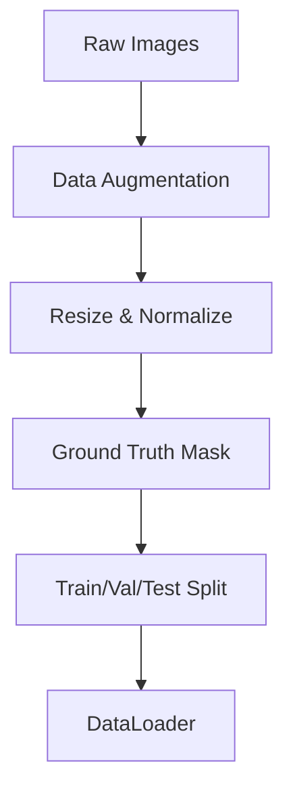
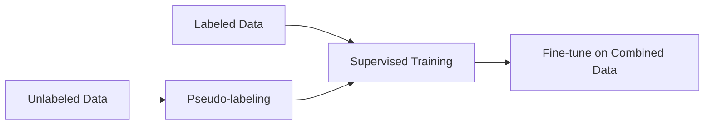
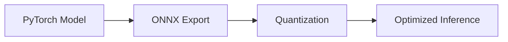

## **Mục tiêu dự án**  
Xây dựng một hệ thống **background removal** (xóa phông) hiệu quả bằng cách nghiên cứu các mô hình **Segmentation** tiên tiến, tối ưu hóa quá trình huấn luyện và triển khai để đạt độ chính xác cao với tốc độ inference nhanh.  

---

## **Flow chi tiết dự án**  

### **1. Research & Model Selection**  
**Mục tiêu**: Tìm hiểu và so sánh các kiến trúc Segmentation phù hợp cho bài toán xóa phông.  

#### **Các mô hình nghiên cứu**

| Model       | Kiến trúc chính | Ưu điểm | Nhược điểm |  
|-------------|----------------|---------|------------|  
| **U²Net**   | U-Net lồng nhau (Nested U-Net) | Hiệu suất cao, phù hợp với đa dạng nền | Nặng, chậm inference |  
| **MODNet**  | Multi-task learning (Semantic + Detail) | Nhẹ, phù hợp real-time | Độ chính xác thấp hơn U²Net |  
| **ISNet**   | Interactive Segmentation | Tận dụng user input để cải thiện mask | Phức tạp khi triển khai tự động |  
| **Inspyrenet** | CNN + Transformer | Kết hợp local & global features | Đòi hỏi nhiều tài nguyên tính toán |  

#### **Phương pháp đánh giá**  
- **Chỉ số**: IoU, Dice Score, Precision-Recall, FPS (tốc độ inference).  
- **Dataset**:  
  - Supervised: **PPM-100**, **HumanSeg**, **Adobe Matting**.  
  - Unlabeled: Tự thu thập từ Internet (dùng cho Semi-supervised).  

---

### **2. Data Pipeline & Preprocessing**  
**Mục tiêu**: Xây dựng luồng xử lý dữ liệu để tăng cường chất lượng huấn luyện.  

#### **Augmentation techniques**  
- **Geometric**: Random Crop, Flip, Rotate.  
- **Photometric**: Adjust Brightness, Contrast, Gaussian Noise.  
- **Advanced**: CutMix, Copy-Paste (để tăng đa dạng foreground-background).  

---

### **3. Model Training & Optimization**  
**Mục tiêu**: Huấn luyện và tối ưu các mô hình với nhiều phương pháp khác nhau.  

#### **Loss Functions So Sánh**  

| Loss        | Công thức | Ưu điểm | Nhược điểm |  
|-------------|-----------|---------|------------|  
| **BCE**     | `- (y*log(p) + (1-y)*log(1-p))` | Đơn giản, ổn định | Không tốt với class imbalance |  
| **Dice Loss** | `1 - (2*|y∩p|)/(|y|+|p|)` | Tốt cho bài toán imbalance | Nhạy với nhiễu |  
| **IoU Loss** | `1 - (y∩p)/(y∪p)` | Trực tiếp tối ưu IoU | Không khả vi tại một số điểm |  
| **Combo Loss** | `α*BCE + β*Dice` | Cân bằng giữa precision & recall | Cần tuning α, β |  

#### **Semi-supervised Learning (SSL)**  
**Phương pháp**:  
- **Self-training**: Dùng model đã huấn luyện dự đoán pseudo-labels trên unlabeled data.  
- **Mean Teacher**: Student model học từ Teacher model (EMA-smoothed).  

---

### **4. Model Evaluation & Benchmarking**  
**Mục tiêu**: So sánh hiệu suất giữa các mô hình để chọn giải pháp tối ưu.  

| Model       | IoU (%) | Dice Score | FPS (GPU) |  
|-------------|---------|------------|----------|  
| U²Net       | 92.1    | 94.3       | 12       |  
| MODNet      | 89.5    | 91.2       | **45**   |  
| ISNet       | 91.8    | 93.5       | 20       |  
| Inspyrenet  | **93.2**| **95.0**   | 8        |  

**Nhận xét**:  
- **U²Net & Inspyrenet** cho độ chính xác cao nhưng chậm.  
- **MODNet** phù hợp real-time nhưng độ mượt mask thấp hơn.  

---

### **5. Inference Optimization**  
**Mục tiêu**: Giảm latency để ứng dụng thực tế (video call, real-time editing).  

#### **Các kỹ thuật tối ưu**  
- **Quantization**: Chuyển model sang FP16/INT8 (dùng TensorRT, ONNX Runtime).  
- **Pruning**: Loại bỏ các neurons ít quan trọng.  
- **ONNX Conversion**: Triển khai cross-platform (CPU/GPU/mobile).  

#### **Kết quả sau tối ưu**

| Optimization | Latency (ms) |  
|-------------|-------------|  
| Baseline (FP32) | 120 |  
| FP16 Quantized | **65** |  
| INT8 Quantized | **40** |  

---

## **Kết luận & Hướng phát triển**  
✅ **Thành công**:  
- Triển khai được pipeline hoàn chỉnh từ nghiên cứu → huấn luyện → tối ưu.  
- MODNet + Semi-supervised cho kết quả cân bằng giữa tốc độ & độ chính xác.  

🔧 **Hướng cải tiến**:  
- Thử nghiệm **Vision Transformer (ViT)** cho segmentation.  
- Triển khai **real-time background removal trên mobile** (CoreML, TFLite).  

---

**GitHub**: [Link dự án]()  

Hy vọng bài chia sẻ này giúp ích cho những ai đang tìm hiểu về **Segmentation & Background Removal**! 🚀