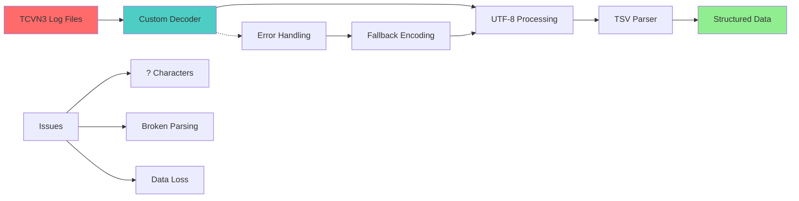
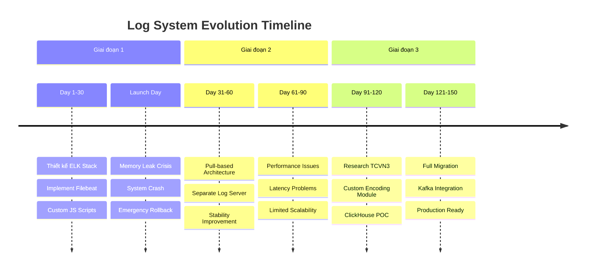

Trong quá trình phát triển một hệ thống game online với quy mô lớn, việc xây dựng một hệ thống log realtime hiệu quả là một thách thức không hề đơn giản. Bài viết này sẽ chia sẻ hành trình của tôi qua 3 giai đoạn phát triển, từ những khó khăn ban đầu đến giải pháp cuối cùng.

## Bối cảnh dự án

Trước khi đi vào chi tiết, hãy cùng tôi điểm qua những con số về quy mô của dự án:
- **12 triệu bản ghi log/ngày**
- **13,000 file log**  
- **9,000-10,000 CCU đồng thời**
- **6 server game**
- Log format: **TSV (Tab-Separated Values)**
- Encoding: **TCVN3** (một thách thức không nhỏ!)

## Giai đoạn 1: Khởi đầu với ELK Stack

### Kiến trúc ban đầu

```
Game Servers → Filebeat → Logstash → Elasticsearch
```

Tôi bắt đầu với kiến trúc truyền thống ELK Stack sử dụng Docker:

- **Filebeat**: Thu thập log từ các game server
- **Logstash**: Parser và xử lý log
- **Elasticsearch**: Lưu trữ và tìm kiếm

### Những thách thức gặp phải

#### 1. Vấn đề Encoding TCVN3
Log của hệ thống sử dụng encoding TCVN3 - một chuẩn encoding cũ của Việt Nam. Điều này buộc tôi phải:
- Viết custom script JavaScript để convert từ TCVN3 sang UTF-8
- Tích hợp script này vào filebeat để convert log trước khi gửi đến Logstash

#### 2. Format TSV phức tạp
Dữ liệu log ở dạng Tab-Separated Values đòi hỏi:
- Tạo custom pipeline parser trong Logstash
- Xử lý các trường hợp edge case với ký tự đặc biệt

#### 3. Vấn đề Memory Leak nghiêm trọng
Đây là vấn đề lớn nhất:
- Filebeat phải harvester 13,000 file đồng thời
- Script JavaScript convert encoding tiêu tốn memory khủng khiếp
- Mặc dù đã cấu hình queue disk, memory leak vẫn xảy ra

### Thảm họa ngày ra mắt

Trong ngày open server, chỉ sau 2 giờ hoạt động:
- **6 server cùng hết memory**
- **Toàn bộ Game Server bị crash**
- **Phải rollback, mất dữ liệu một khoảng thời gian**
- **Phải stop service log**

Đây là bài học đắt giá về tầm quan trọng của việc test với dữ liệu thực tế!

## Giai đoạn 2: Giải pháp tạm thời

### Kiến trúc mới

```
Game Servers ← Log Server (Pull) → Filebeat → Logstash → Elasticsearch
```

Sau sự cố, tôi nhanh chóng chuyển sang mô hình:
- **Tách riêng Log Server**: Pull log từ các Game Server
- **Giảm tải cho Game Server**: Không còn phải chạy Filebeat trên Game Server mọi thử sẽ xử lý ở `Log Server`
- **Xử lý centralized**: Tập trung xử lý tại một điểm

### Kết quả
- ✅ Giải quyết được vấn đề crash server
- ❌ Hiệu suất chậm, không thể realtime
- ❌ Độ phức tạp của hệ thống tăng cao

## Giai đoạn 3: Đột phá với ClickHouse

### Nghiên cứu sâu về TCVN3

Trước khi chuyển đổi công nghệ, tôi quyết định giải quyết triệt để vấn đề encoding:

> **Tham khảo chi tiết**: [Custom TCVN3 Encoding Implementation - A Deep Dive](https://tuanha1305.github.io/2025/09/13/custom-tcvn3-encoding-implementation-a-deep-dive.html)

Những khó khăn khi làm việc với TCVN3:
- Encoding rất cũ, ít tài liệu
- Các ký tự `?` xuất hiện khi decode sai
- Cần viết custom encoder/decoder

### Kiến trúc mới hoàn toàn

```
Game Servers → Custom Log Service → Kafka → Logstash → ClickHouse
```

### Tại sao chọn tech stack này?

#### ClickHouse
- **Database chuyên biệt cho log**: Tốc độ ghi cực nhanh
- **Columnar storage**: Tối ưu cho analytical queries  
- **Compression tốt**: Tiết kiệm storage
- **Scale horizontal**: Dễ dàng mở rộng

#### Kafka
- **Message Queue đáng tin cậy**: Đảm bảo không mất dữ liệu
- **High throughput**: Xử lý hàng triệu message/giây
- **Decoupling**: Tách biệt producer và consumer

#### Logstash  
- **Parser mạnh mẽ**: Hỗ trợ tốt TSV format
- **Plugin ecosystem**: Nhiều plugin có sẵn
- **Flexible**: Dễ dàng customize

#### Custom Log Service
- **TCVN3 Support**: Native support encoding/decoding
- **Optimized**: Tối ưu cho use case cụ thể
- **Resource efficient**: Kiểm soát tài nguyên tốt hơn

### Kết quả ấn tượng

Sau khi triển khai:
- **Tốc độ write**: Mượt mà, không lag
- **Memory usage**: Ổn định, không leak
- **Realtime**: Đạt được mục tiêu ban đầu
- **Scalability**: Dễ dàng scale khi cần

## Bài học kinh nghiệm

### 1. Kiến thức thực hành quan trọng
- Test với dữ liệu production là bắt buộc
- Không thể chỉ dựa vào test với dữ liệu mẫu
- Performance testing phải được thực hiện nghiêm túc

### 2. Quản lý tài nguyên hệ thống
- **Resource Limiting**: Luôn giới hạn tài nguyên cho mỗi service
- **Monitoring**: Thiết lập monitor cho CPU, Memory, Disk
- **Auto-recovery**: Script tự động kill process khi phát hiện leak

#### Script Monitor mẫu:
```bash
#!/bin/bash
# Monitor và kill process nếu memory usage > threshold
THRESHOLD=80
PROCESS_NAME="filebeat"

while true; do
    MEMORY_USAGE=$(ps aux | grep $PROCESS_NAME | grep -v grep | awk '{sum+=$4} END {print sum}')
    if (( $(echo "$MEMORY_USAGE > $THRESHOLD" | bc -l) )); then
        echo "Memory usage $MEMORY_USAGE% exceeds threshold $THRESHOLD%"
        pkill $PROCESS_NAME
        sleep 10
        # Restart service
        systemctl restart $PROCESS_NAME
    fi
    sleep 30
done
```

### 3. Chọn công nghệ phù hợp
- Không có giải pháp one-size-fits-all
- Cần hiểu rõ requirements và constraints
- Đôi khi phải viết custom solution

### 4. Tầm quan trọng của encoding



- Encoding issues có thể ảnh hưởng toàn bộ hệ thống
- Cần có expertise về encoding đang sử dụng
- Custom implementation đôi khi là cần thiết

## Timeline Overview



## Kết luận

Hành trình từ ELK Stack truyền thống đến ClickHouse đã dạy cho tôi những bài học quý giá:

1. **Luôn test với production data**
2. **Chọn công nghệ phù hợp với use case**  
3. **Monitor và limit resource usage**
4. **Không ngại viết custom solution khi cần**
5. **Backup plan luôn cần thiết**

Hệ thống log realtime cuối cùng không chỉ đáp ứng được yêu cầu kỹ thuật mà còn ổn định, scalable và maintainable. Đây là minh chứng cho việc đôi khi chúng ta cần dũng cảm thay đổi và đổi mới để đạt được mục tiêu.

---

**Tags**: #RealTimeLogging #ClickHouse #ELK #Kafka #TCVN3 #SystemDesign #GameDevelopment

**Nguồn tham khảo**:
- [Custom TCVN3 Encoding Implementation](https://tuanha1305.github.io/2025/09/13/custom-tcvn3-encoding-implementation-a-deep-dive.html)
- [ClickHouse Documentation](https://clickhouse.com/docs)
- [Kafka Performance Tuning](https://kafka.apache.org/documentation/#performance)